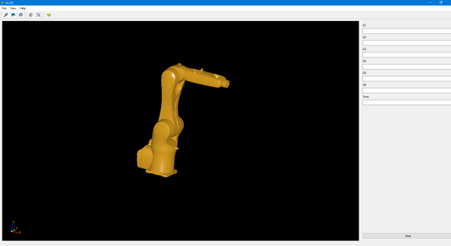
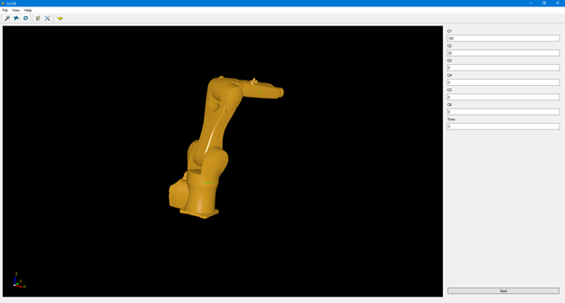
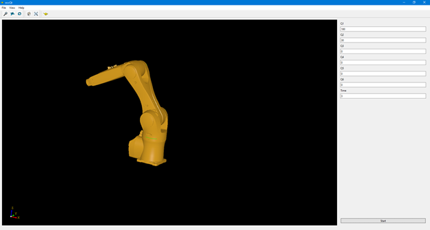
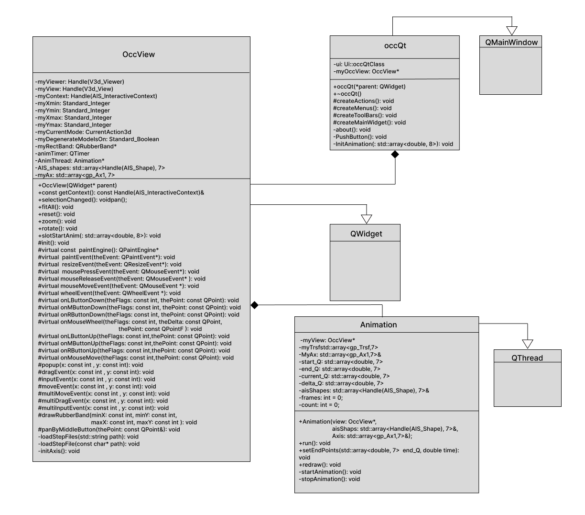

# Проект 3D-анимации робота Kuka.

**Цель работы:** визуализировать анимацию перемещения промышленного робота Kuka, представленного в виде step файлов (каждое звено - отдельный step файл).

Пример работы приложения.

Отношение классов в проекте представленно UML диаграммой

Краткое описание классов:

* occQt – класс реализующий главное окно приложения, внутри данного класса находится указатель на объект класса OccView.
* OccView – класс реализующий виджет отображения 3D объектов, загрузку моделей 3D объектов в формате step, методы изменяющие вид камеры сцене. Внутри класса находится указатель на объект класса Animation.
* Animation – класс создающий поток выполнения в котором происходит перерисовка анимации. Данному классу передаются параметры анимируемых элементов и параметры анимации.