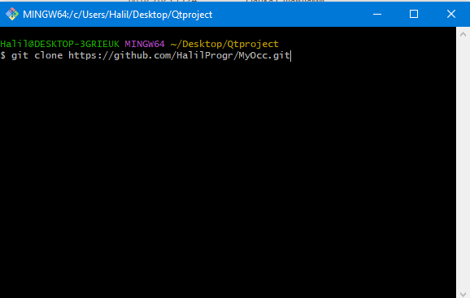

# Развёртывания приложения
1. Необходимо скачать с сайта https://dev.opencascade.org/release инсталлятор Open Cascade.
2. Необходимо скачать и установить Qt Redactor, при установке необходимо включить следующие пункты:


3. Клонировать данный проект командой ```git clone https://github.com/HalilProgr/MyOcc.git ```

4. Открыть файл occQt.pro с помошью Qt Redactor. 
 
5. При первом запуске проекта у вас будет возможность выбрать компилятор. Необходимо выбрать компилятор ```Desktop Qt 6.4.3 MSVC2019 64bit ``` 
6. Изменить переменную ```CASROOT``` на путь до установленого Open Cascade в вашей системе.